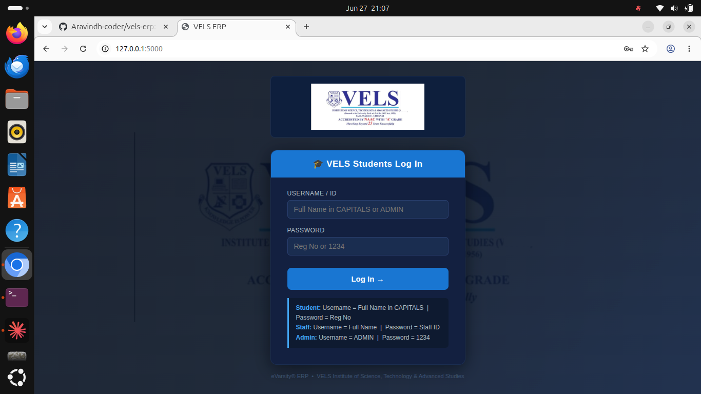
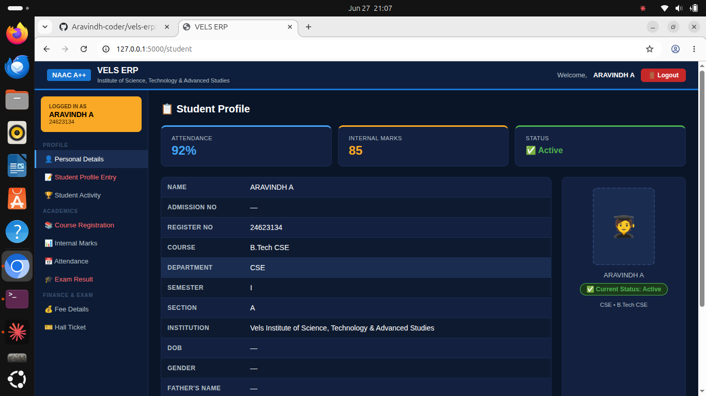
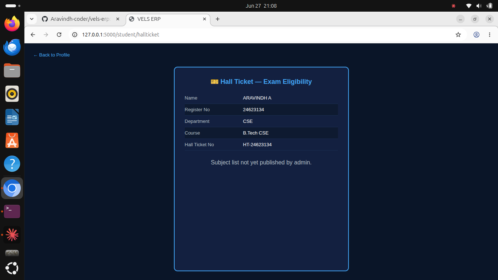
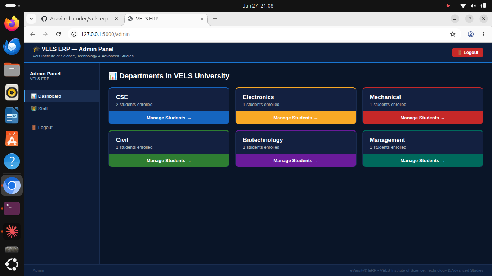
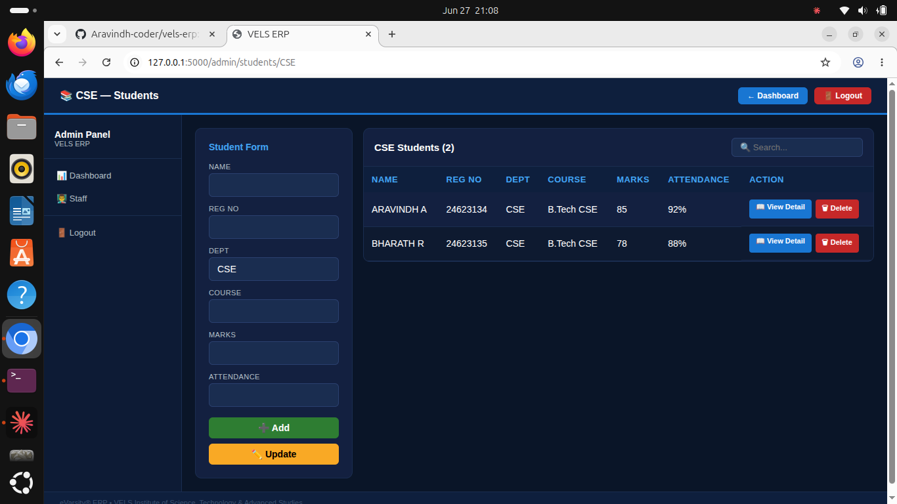
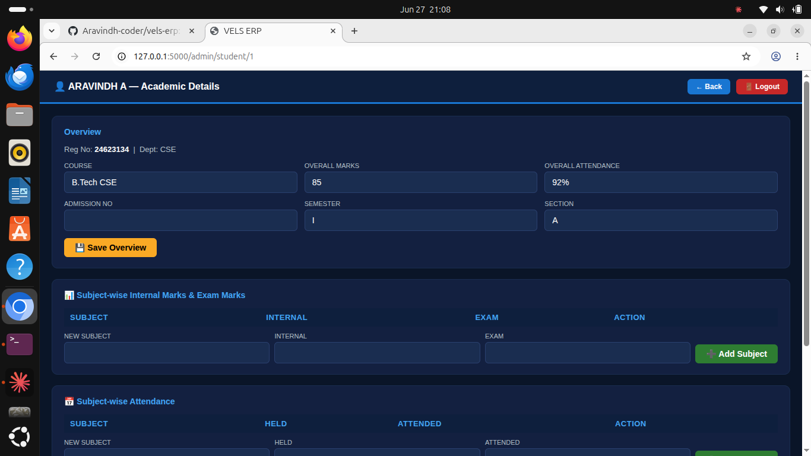

# VELS ERP System

A lightweight Flask-based ERP (Enterprise Resource Planning) web application built for VELS Institute of Science, Technology & Advanced Studies (VISTAS). Supports separate login portals for **Students**, **Staff**, and **Admin**, with role-based dashboards and editable personal/academic records.

## Features

### Student Portal
- Login via Full Name + Register Number
- View personal & academic profile (Name, Course, Department, DOB, etc.)
- Edit personal details (address, contact, email, family details, etc.) — academic fields remain admin-only
- View Student Activity, Course Registration, Subject-wise Attendance, Internal Marks, Exam Results, Fee Details, and Hall Ticket

### Staff Portal
- Login via Full Name + Staff ID
- View and edit personal profile details

### Admin Portal
- Dashboard with department-wise student counts
- Add / Update / Delete students and staff
- Per-student detail page to manage:
  - Subject-wise Internal & Exam Marks
  - Subject-wise Attendance (classes held/attended)
  - Fee Records (amount, paid, due date, status)

## Tech Stack
- **Backend:** Python, Flask
- **Database:** SQLite
- **Frontend:** HTML, CSS (Jinja2 templates)

## Getting Started

### Prerequisites
- Python 3.x
- pip

### Installation
1. Clone the repository
2. Install dependencies: `pip install -r requirements.txt --break-system-packages`
3. Run the app: `python3 app.py`
4. Open your browser at `http://localhost:5000`

### Default Login Credentials
| Role    | Username              | Password   |
|---------|------------------------|------------|
| Student | ARAVINDH A             | 24623134   |
| Staff   | Dr. SURESH KUMAR       | STF001     |
| Admin   | ADMIN                  | 1234       |

## Screenshots

## Project Structure

- app.py
- requirements.txt
- static/vels_logo.png
- templates/ (login.html, student_dashboard.html, admin_dashboard.html, and more)
- screenshots/ (project screenshots)

## License
This project is for educational/internal institutional use.
